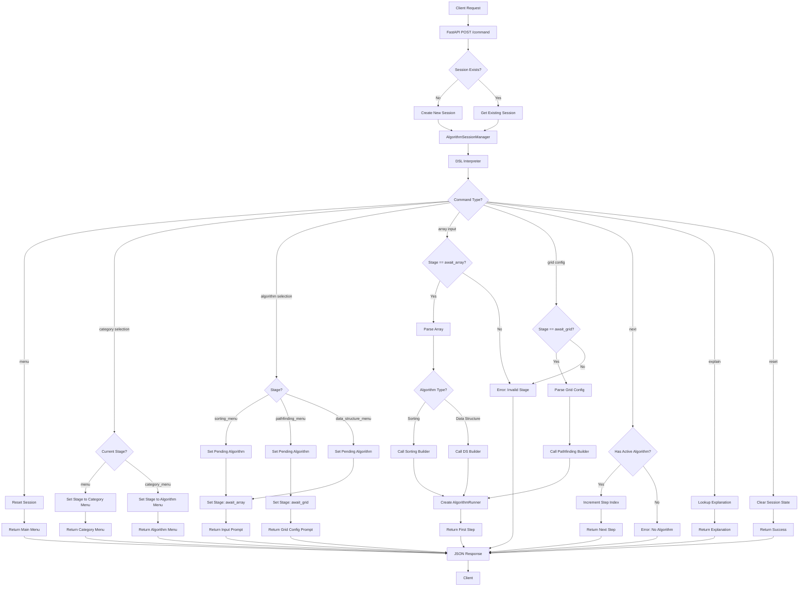
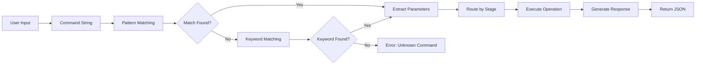
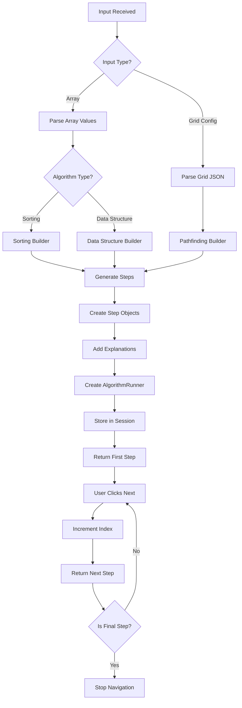
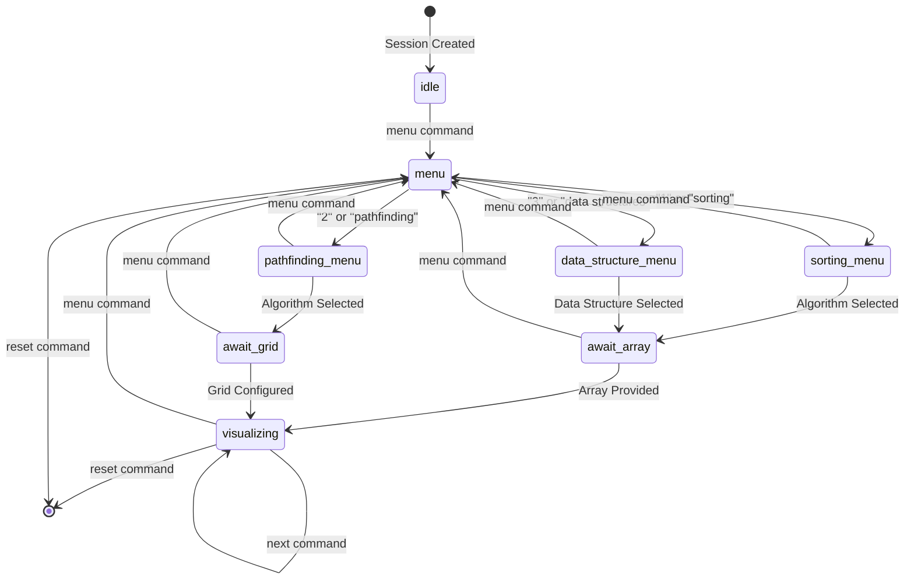
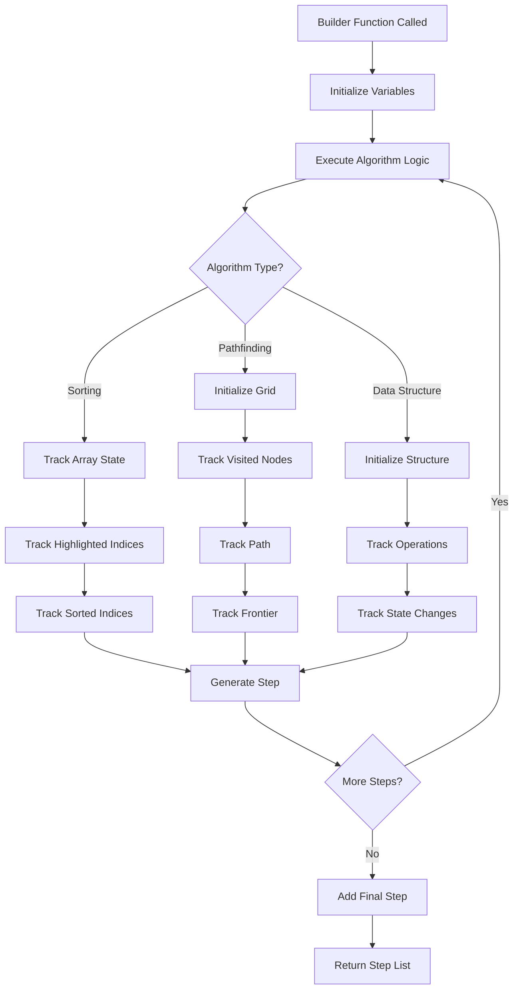
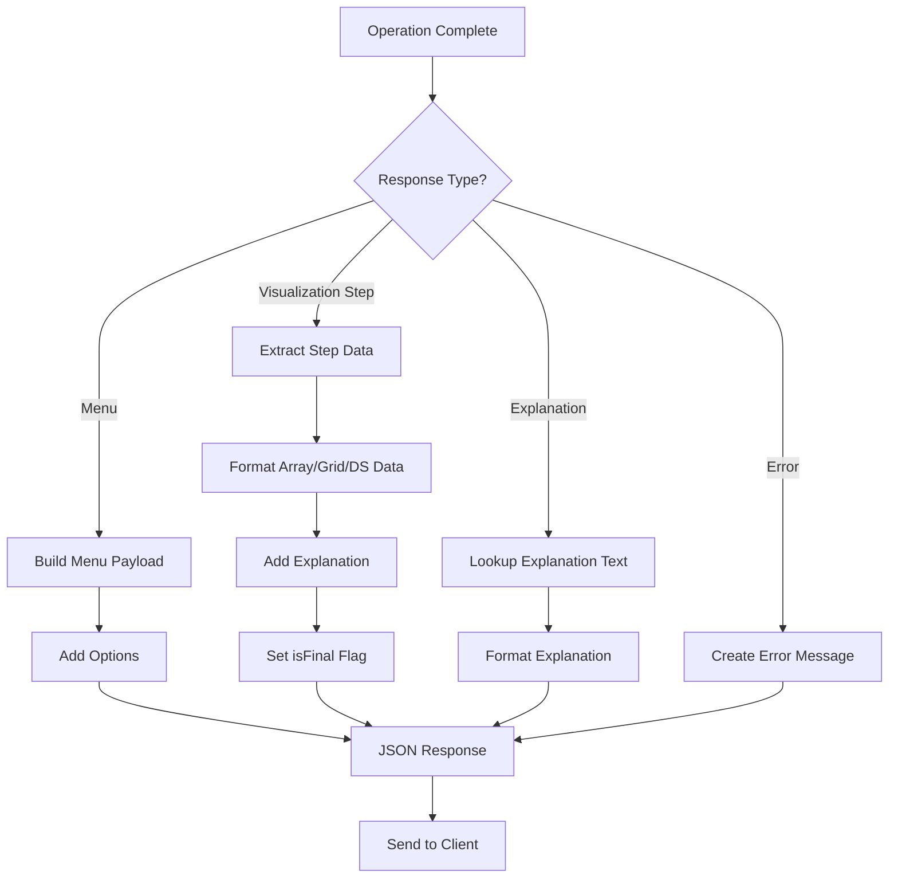
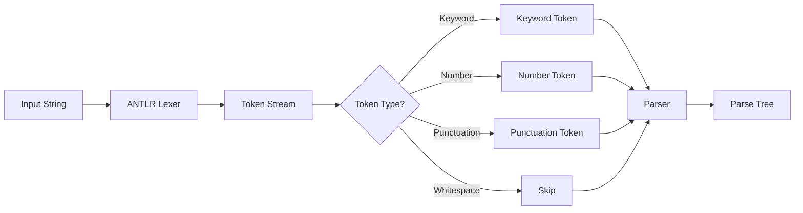
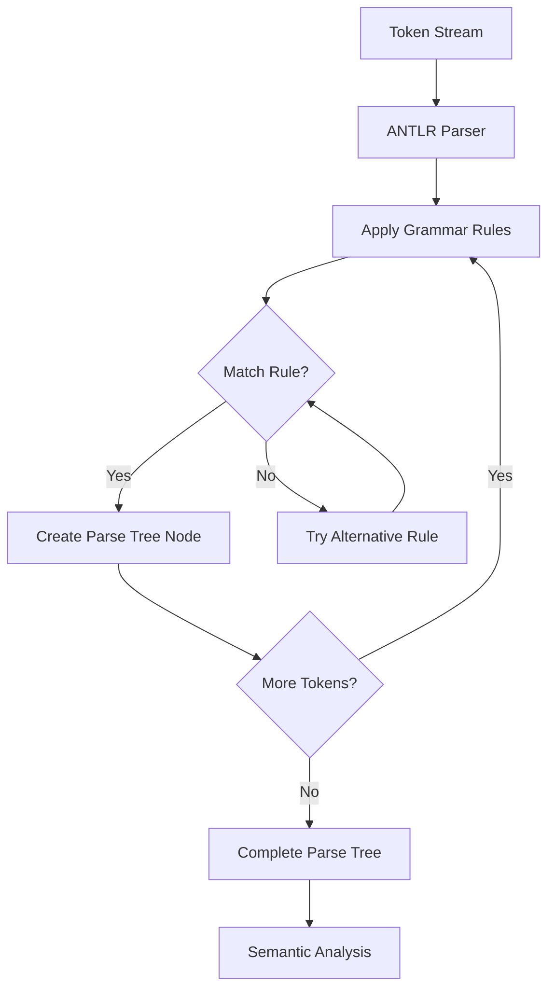
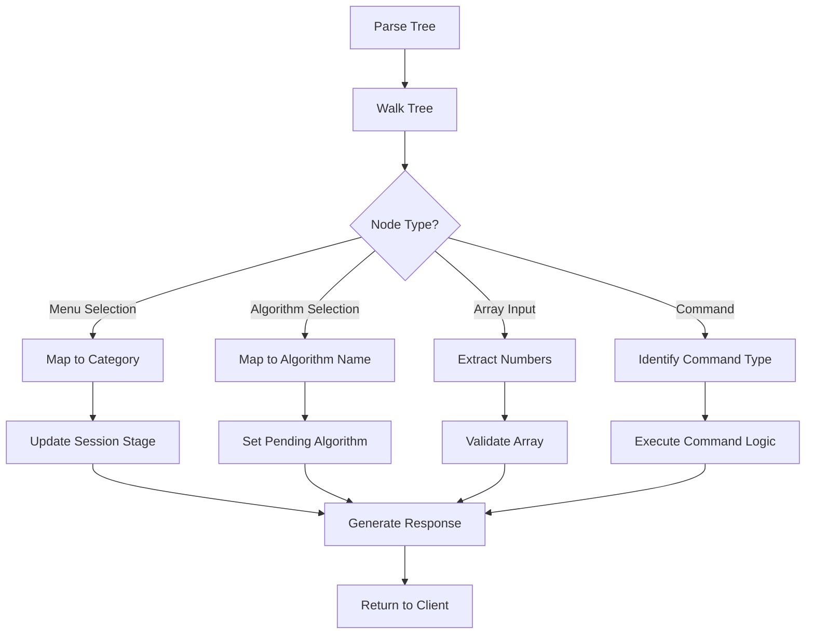

# System Workflow Diagram

## Main System Flow

## Command Processing Flow

## Algorithm Visualization Flow

## Session State Machine

## Algorithm Builder Flow

## Response Generation Flow

## Lexical Analysis Flow

## Syntax Analysis Flow

## Semantic Analysis Flow

